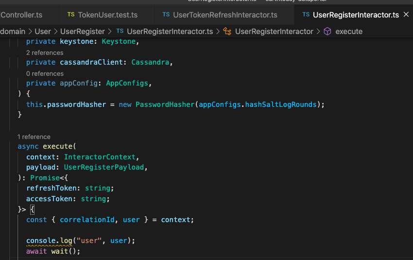
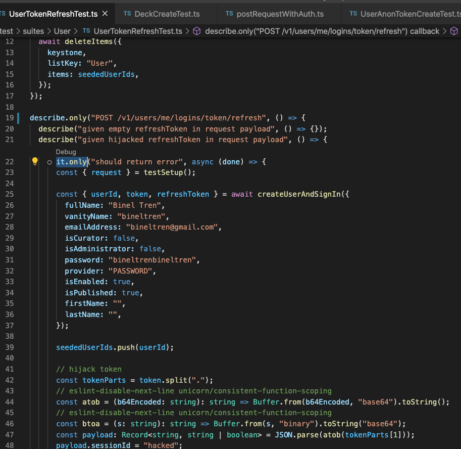

# Tips for writing test cases

## Logging

Mánh nhỏ khi mình muốn log gì đó trong code khi chạy integration test:

```js
await wait()
```

vào để nó delay chút trước khi test kết thúc.
Vì có vẻ như integration test nó exit nhanh quá hay sao ấy nên không có wait thì sẽ ko thấy được console.log gõ ở trên




## Limit running test cases

Để thuận tiện hơn khi viết test thì mình có thể giới hạn chỉ chạy 1 (số) test bằng cách thêm `.only` nhoé



